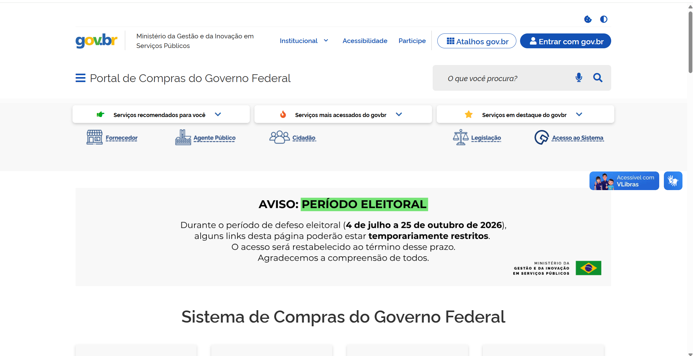

PROCEDIMENTOS PARA REALIZAÇÃO DE LICITAÇÕES ELETRÔNICAS TRADICIONAIS
====================================================================

**OBS.: Contratações no Sistema de Registro de Preços estão no manual CONTRATAÇÕES SRP**

PRIMEIRA ETAPA: CRIAR A CONTRATAÇÃO
-----------------------------------

Passo 1: Acesse o Portal de Compras do Governo Federal e clique em “Acesso ao Sistema”.

Passo 2: Escolha o perfil Governo e clique em “Entrar com Gov.br”. (Tela 02)

Passo 3: Na área de trabalho do usuário Governo, clique em “Novo Divulgação de Compras” (Tela 03)

Passo 4: E em seguida clique em “+Criar” (Tela 04)

Passo 5: Preencha todas as informações relacionadas ao processo e clique em “Concluir” (Tela 05) OBS.: O número de controle interno da UASG tem por objetivo permitir que cada órgão tenha seu controle de processos, registrado no sistema para melhor rastreabilidade. O preenchimento desse número é facultativo.

.. attention::

   OBS.: O número de controle interno da UASG tem por objetivo permitir que cada órgão tenha seu controle de processos, registrado no sistema para melhor rastreabilidade. O preenchimento desse número é facultativo.
